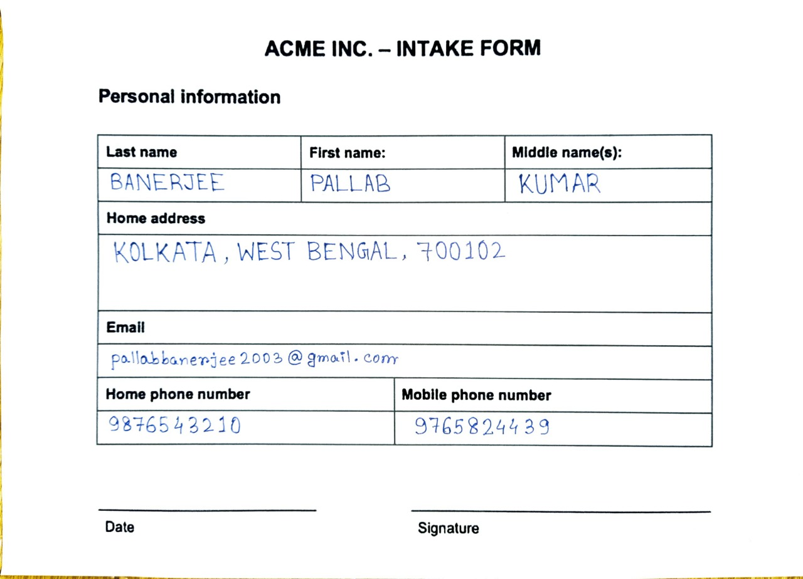

# 📄 Automated OCR-Based Data Entry System

## 🚀 Overview
This project automates manual data entry by extracting text from images using OCR and converting it into structured Excel format.

## 🎯 Problem Statement
Manual data entry from documents is time-consuming and error-prone. This system eliminates manual effort by automating text extraction and structuring.

## 🛠 Tech Stack
- Python
- Tesseract OCR
- OpenCV
- Pandas

## ⚙️ Workflow
1. Input Image
2. Image Preprocessing (Grayscale, Noise Removal, Thresholding)
3. Text Extraction using OCR
4. Data Parsing & Structuring
5. Export to Excel

## 📸 Demo

### Input Image


### Output Excel


## ✨ Features
- Automated text extraction
- Image preprocessing for improved accuracy
- Structured Excel output generation
- Modular pipeline design

## ▶️ How to Run

```bash
pip install -r requirements.txt
